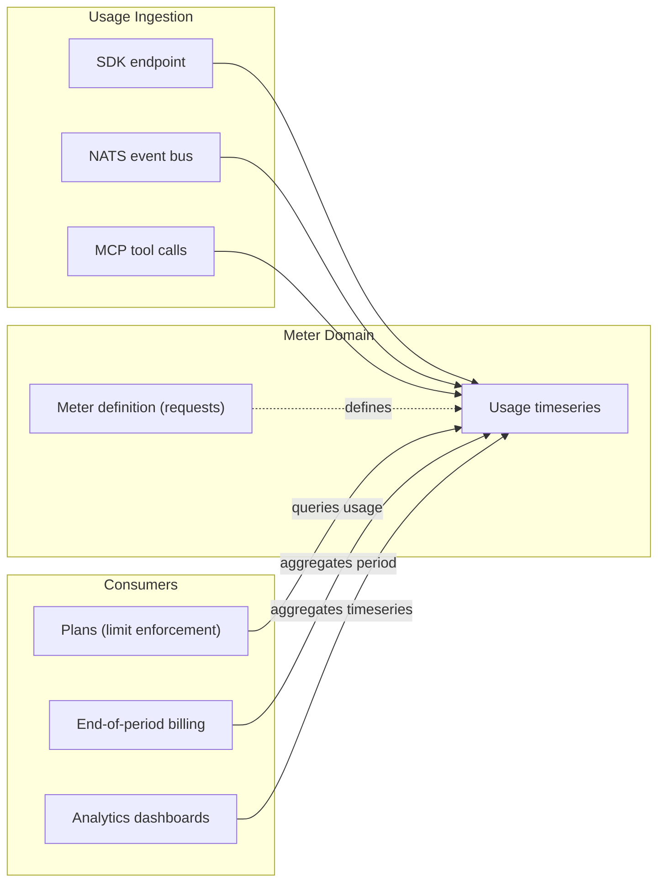

Meters are the foundation of usage tracking in SolvaPay. A meter defines **what** to measure and **how** to aggregate usage data. Usage records are the **raw data points** recorded against those definitions and stored in the Usage timeseries collection.

Every provider automatically gets a `requests` meter when created. This meter is the only meter in the system — it tracks all billable request activity and powers limit enforcement, usage billing, and analytics.

## How Meters Work

1. Each provider gets a **`requests` meter** automatically — no configuration needed
2. Your application **records usage** via the SDK, NATS, or automatically through MCP tool calls
3. Other systems **consume the data** — plans enforce limits, billing calculates costs, dashboards visualize trends

## Meter Fields

| Field | Type | Description |
|-------|------|-------------|
| `reference` | `string` | Auto-generated unique identifier (`mtr_XXXXXXXX`) |
| `name` | `string` | Machine-readable name, unique per provider (e.g. `requests`) |
| `displayName` | `string` | Human-readable label shown in dashboards |
| `description` | `string?` | Optional description of what the meter tracks |
| `aggregation` | `enum` | How usage records are aggregated: `count` or `sum` |
| `unit` | `string` | Label for the metric unit (e.g. `requests`) |
| `status` | `enum` | `active` or `archived` |

## The `requests` Meter

Every provider automatically receives a `requests` meter when their account is created:

| Name | Aggregation | Unit | Purpose |
|------|-------------|------|---------|
| `requests` | count | requests | Tracks all billable request activity |

This meter is auto-configured per provider and cannot be archived. It is seeded idempotently — creating a provider multiple times is safe.

## Aggregation

The `requests` meter uses `count` aggregation, which counts each usage record as one unit. SolvaPay also supports `sum` aggregation for meters that accumulate numeric values (e.g. tokens consumed), though only the `requests` meter is currently in use.

| Aggregation | Behavior |
|-------------|----------|
| `count` | Each usage record counts as 1 |
| `sum` | Each usage record contributes its `value` field to the total |

## How Meters Connect to Plans

Usage-based and hybrid plans specify `measures: 'requests'`, which links them to the provider's auto-assigned `requests` meter. This link enables:

- **Limit enforcement** — the plan's `limit` field sets a hard cap on the meter's aggregated value per billing period
- **Free units** — the plan's `freeUnits` field defines how many units are included before billing starts
- **Usage billing** — at end-of-period, the meter's aggregated value determines the billable amount

See [Plans](/plans/overview) and [Billing](/plans/billing) for details.

## Next Steps

- [Usage Records](/meters/events) — recording and querying usage data
- [Plans](/plans/overview) — how plans reference meters for billing and limits
- [Billing](/plans/billing) — end-of-period usage billing
