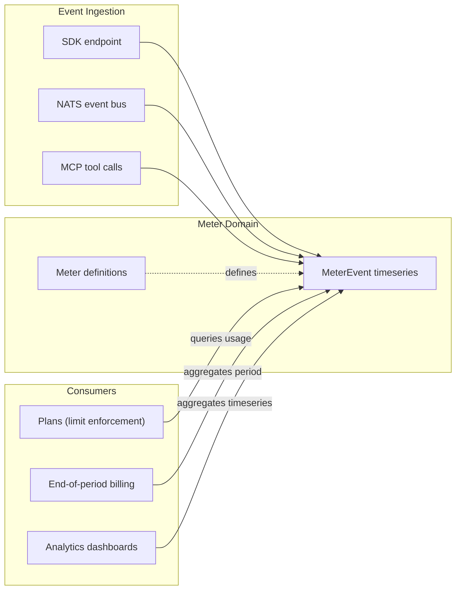

Meters are the foundation of usage tracking in SolvaPay. A meter defines **what** to measure — API requests, token consumption, tool invocations, or any custom metric. Meter events are the **raw data points** recorded against those definitions.

Meters are fully standalone. They exist independently of products, plans, and purchases, which makes them flexible enough to power billing, access control, analytics, and reporting from a single source of truth.

## How Meters Work



1. You **define meters** — named metrics with an aggregation type and unit
2. Your application **records events** against those meters via the SDK, NATS, or automatically through MCP tool calls
3. Other systems **consume the data** — plans enforce limits, billing calculates costs, dashboards visualize trends

## Meter Fields

| Field | Type | Description |
|-------|------|-------------|
| `reference` | `string` | Auto-generated unique identifier (`mtr_XXXXXXXX`) |
| `name` | `string` | Machine-readable name, unique per provider (e.g. `api_requests`, `tool:search`) |
| `displayName` | `string` | Human-readable label shown in dashboards |
| `description` | `string?` | Optional description of what the meter tracks |
| `aggregation` | `enum` | How events are aggregated: `count`, `sum`, `max`, `min`, or `avg` |
| `unit` | `string` | Label for the metric unit (e.g. `requests`, `tokens`, `calls`) |
| `isDefault` | `boolean` | Whether this is a system-seeded meter (protected from archival) |
| `status` | `enum` | `active` or `archived` |

## Default Meters

Every provider automatically receives four default meters:

| Name | Aggregation | Unit | Purpose |
|------|-------------|------|---------|
| `api_requests` | count | requests | General API request tracking |
| `requests` | count | requests | Generic request counter |
| `api_calls` | count | calls | API call tracking |
| `tokens` | sum | tokens | Token consumption (LLM workloads) |

Default meters cannot be archived. They are seeded idempotently — calling the seed endpoint multiple times is safe.

## MCP Tool Meters

When you register an MCP server, SolvaPay automatically creates a meter for each discovered tool using the naming convention `tool:{toolName}`. For example, a tool called `search_documents` gets a meter named `tool:search_documents`.

This happens automatically during:

- **Server creation** — meters are created for all non-virtual tools
- **Server updates** — new tools get meters, removed tools have their meters archived

Archived tool meters retain all historical event data. Only new events are blocked.

<Note>
Virtual tools (like checkout and account management tools injected by SolvaPay) do not get meters.
</Note>

## Custom Meters

Create custom meters to track any metric specific to your business:

```bash
# Create via API
curl -X POST https://api.solvapay.com/ui/meters \
  -H "Authorization: Bearer YOUR_TOKEN" \
  -H "Content-Type: application/json" \
  -d '{
    "name": "image_generations",
    "displayName": "Image Generations",
    "description": "Number of images generated",
    "aggregation": "count",
    "unit": "images"
  }'
```

### Aggregation Types

Choose the aggregation type that matches your metric:

| Aggregation | Use Case | Example |
|-------------|----------|---------|
| `count` | Count occurrences | API requests, tool invocations |
| `sum` | Accumulate values | Tokens consumed, bytes transferred |
| `max` | Track peak values | Max concurrent connections |
| `min` | Track minimum values | Lowest response time |
| `avg` | Average over period | Average latency |

## Managing Meters

### Listing Meters

```bash
# List all active meters
GET /ui/meters?status=active

# List archived meters
GET /ui/meters?status=archived
```

Meters are sorted with default meters first, then alphabetically by name.

### Updating Meters

You can update a meter's `displayName`, `description`, and `status`:

```bash
PUT /ui/meters/mtr_XXXXXXXX
{
  "displayName": "Updated Name",
  "description": "Updated description"
}
```

### Archiving Meters

Archiving a meter prevents new events from being recorded but preserves all historical data:

```bash
POST /ui/meters/mtr_XXXXXXXX/archive
```

Default meters cannot be archived.

## How Meters Connect to Plans

Usage-based and hybrid plans reference a meter via `meterId`. This link enables:

- **Limit enforcement** — the plan's `limit` field sets a hard cap on the meter's aggregated value per billing period
- **Free units** — the plan's `freeUnits` field defines how many units are included before billing starts
- **Usage billing** — at end-of-period, the meter's aggregated value determines the billable amount

See [Plans](/plans/overview) and [Billing](/plans/billing) for details.

## Next Steps

- [Meter Events](/meters/events) — recording and querying usage data
- [Plans](/plans/overview) — how plans reference meters for billing and limits
- [Billing](/plans/billing) — end-of-period usage billing
