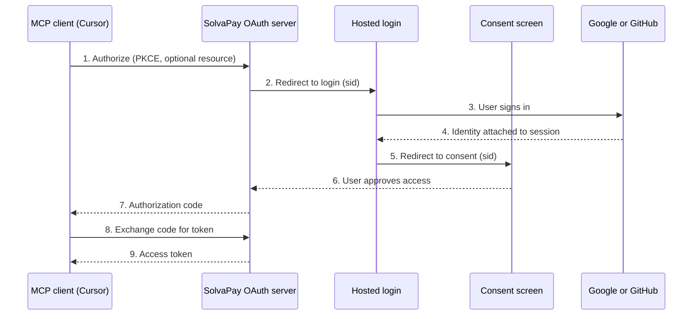

## Supported Authentication Providers

Users can authenticate using:

- **Google** - Sign in with Google account
- **GitHub** - Sign in with GitHub account

No passwords or API keys to manage—users authenticate with their existing accounts.

## How MCP Client Authentication Works

When a user adds your MCP server to their client (e.g., Cursor), the following OAuth flow occurs:

### Flow Steps

1. **MCP client initiates OAuth** — Client requests authorization with PKCE and optional `resource` (protected resource URL).
2. **Redirect to hosted login** — User sees a branded login page with your provider branding. SolvaPay creates a short-lived consent session (`sid` in the URL).
3. **User authenticates** — User signs in with Google, GitHub, or email/password. Login attaches identity to the consent session; it does not issue an authorization code yet.
4. **Consent screen** — User reviews requested scopes, the redirect destination, and SolvaPay Terms/Privacy, then approves or cancels.
5. **Authorization code returned** — After approval, SolvaPay redirects to the MCP client callback with an authorization code. Cancel returns `access_denied` with no account or token created.
6. **Token exchange** — Client exchanges the code for an access token (PKCE verifier required).
7. **Authenticated** — Client can make tool calls with the access token.

## Dynamic Client Registration (DCR)

The no-code MCP integration supports **Dynamic Client Registration**, allowing MCP clients to automatically register themselves as OAuth clients. This means users can simply paste your proxy URL into their MCP client, and the client will handle all OAuth setup automatically.

### How DCR Works

1. User adds your proxy URL to their MCP client
2. Client discovers the OAuth endpoints via MCP protocol
3. Client registers itself using the DCR endpoint
4. Client receives client credentials
5. Client proceeds with standard OAuth flow

For API-driven MCP setup, you can provision product, plans, origin URL, and tool mapping through
`POST /v1/sdk/products/mcp/bootstrap`. That endpoint returns MCP server identity fields including the
proxy URL and the resolved default plan.

The DCR endpoint is available at your proxy URL and follows the **OAuth 2.0 Dynamic Client Registration Protocol (RFC 7591)**.

### Benefits of DCR

- **Zero configuration** - Users just paste a URL
- **Automatic setup** - No manual client ID/secret management
- **Standard protocol** - Works with any DCR-compatible client

## Hosted Login Page

When users authenticate, they see a branded login page that includes:

- Your provider logo and name
- Your brand colors
- Google and GitHub sign-in buttons
- Automatic account creation for new users

No additional configuration is needed—the login page automatically uses your provider branding configured in **Settings > Pages**.

### First-Time Users

When a user approves consent for the first time:

1. Their customer account is created (if new)
2. They're assigned your default (free) plan
3. They're redirected back to their MCP client with an authorization code
4. After token exchange, they can use tools according to their plan

## OAuth Scopes

The OAuth server supports standard OpenID Connect scopes:

| Scope | Description |
|-------|-------------|
| `openid` | Required for OpenID Connect |
| `profile` | Access to user's name and avatar |
| `email` | Access to user's email address |

## Custom Protocol Support

MCP clients often use custom URL protocols for OAuth callbacks:

- `cursor://` - Cursor IDE
- `claude://` - Claude Desktop
- `vscode://` - VS Code extensions

The no-code MCP integration fully supports these custom protocols, ensuring seamless authentication across different MCP client applications. The OAuth server correctly handles redirects to these custom schemes.

## Redirect URI allowlist

DCR rejects any `redirect_uri` that is neither a known custom-protocol scheme nor a host on the HTTPS allowlist. When a client registers a disallowed URI, the server now returns an explicit `Invalid redirect_uri: <uri>` error instead of a generic rejection, so client logs surface the offending value.

Default allowlist entries include:

- Localhost (`http://localhost`, `http://127.0.0.1` with any port) for local development and MCP Inspector
- `*.mcpjam.com` — MCP Jam's hosted inspector subdomains
- Custom protocol schemes: `cursor://`, `claude://`, `vscode://`, `cline://`, and the other MCP-client schemes above

Two environment knobs on the backend control the allowlist at deploy time:

| Variable | Effect |
|---|---|
| `OAUTH_DCR_ALLOWED_REDIRECT_HOST_SUFFIXES` | Comma-separated list of DNS suffixes (e.g. `inspector.example.com,mcp.myco.dev`) appended to the defaults |
| `OAUTH_DCR_ALLOW_ANY_HTTPS_REDIRECTS` | Set to `true` to accept any HTTPS URL (use only in trusted environments — this disables the allowlist) |

Both keys are also exposed as `oauthDcrAllowedRedirectHostSuffixes` / `oauthDcrAllowAnyHttpsRedirects` fields on the internal config for runtime overrides.

## Token Lifecycle

### Access Tokens

- Used to authenticate tool calls
- Short-lived for security
- Automatically refreshed by MCP clients

### Refresh Tokens

- Used to obtain new access tokens
- Longer-lived than access tokens
- Revoked when user logs out or purchase is cancelled

## Security Considerations

### PKCE (Proof Key for Code Exchange)

All OAuth flows use PKCE to prevent authorization code interception attacks. This is especially important for public clients like desktop applications.

### Token Storage

- Tokens are securely stored by the MCP client
- Access tokens are never exposed in URLs
- Refresh tokens enable persistent sessions

### Session Management

Users can manage their active sessions through the customer portal, including:

- Viewing connected clients
- Revoking access to specific clients
- Signing out of all sessions

## Troubleshooting

### Authentication Fails

If users can't authenticate:

1. Verify your MCP server is active in the console
2. Check that the proxy URL is correct
3. Ensure the user's browser allows popups (for OAuth redirect)

### Token Expired

If tool calls fail with authentication errors:

1. The MCP client should automatically refresh the token
2. If refresh fails, user may need to re-authenticate
3. Check if the user's purchase is still active

### DCR Not Working

If Dynamic Client Registration fails:

1. Verify the MCP client supports DCR (RFC 7591)
2. Check client is using the correct proxy URL
3. Review client logs for specific error messages

## Next Steps

- [Hosted Pages](/no-code-mcp/hosted-pages) - Configure checkout and customer portal
- [Best Practices](/no-code-mcp/best-practices) - Plan configuration and security tips
