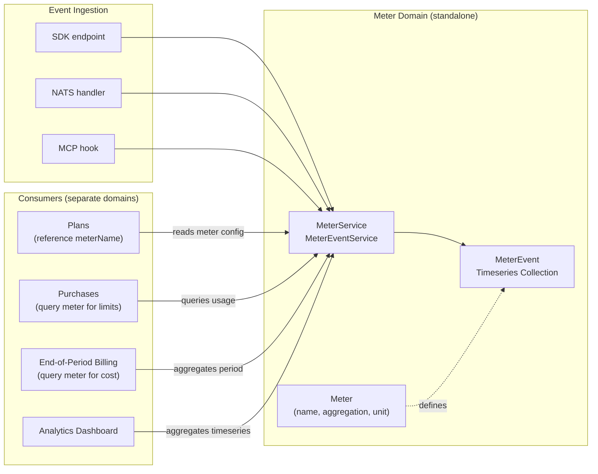

# Usage Analytics Refactoring

> **Overview:** Introduce a standalone Meter domain with a MongoDB timeseries collection for events, fully decoupled from purchases/products/plans. Other domains consume meters to drive billing and limits. Comprehensive tests included.

---

## Current State Summary

Usage is deeply coupled to the purchase lifecycle. Recording a single event currently requires: resolving customer, resolving product, finding the active purchase, atomically incrementing `purchase.usage.used`, calculating overage, and then creating a `UsageEvent` document. The `UsageEvent` schema has 15+ fields including `purchaseReference`, `productId`, `productReference`, and `actionType` — all tying it to the purchase/product domain.

Key files in the current system:

- `solvapay-backend/src/usage/schemas/usage.schema.ts` — current event schema (not a timeseries collection)
- `solvapay-backend/src/usage/services/usage.service.ts` — recording + querying
- `solvapay-backend/src/purchases/services/purchase.service.ts` — `recordAction()` (line 540) does atomic `$inc` on `purchase.usage.used`
- `solvapay-backend/src/purchases/handlers/end-of-period-billing.handler.ts` — cron billing

---

## Core Principle: Meters Are Standalone

The Meter domain is a **completely independent** module. It has zero knowledge of purchases, products, or plans. It only knows about:

- **Meters** — named metric definitions (what to track)
- **MeterEvents** — timestamped data points (the actual tracking data)
- **Providers** — for multi-tenancy (providerId)

Other domains (purchases, plans, products) are **consumers** of meter data. They reach into the Meter module to query event aggregations. The Meter module never reaches back.



---

## Data Model

### Meter Schema

New file: `solvapay-backend/src/meters/schemas/meter.schema.ts`

```typescript
class Meter extends BaseModel {
  reference: string              // "meter_abc123"
  providerId: Types.ObjectId
  name: string                   // "api_requests" — unique per provider+env
  displayName: string            // "API Requests"
  description?: string
  aggregation: 'count' | 'sum' | 'max' | 'min' | 'avg'
  unit: string                   // "requests", "bytes", "ms"
  isDefault: boolean             // system-defined, protected from deletion
  status: 'active' | 'archived'
  environment: 'sandbox' | 'live'
}
```

No references to purchases, products, or plans anywhere in this schema. A meter can exist with zero tracked users — it's a definition of *what* to track, not evidence that tracking has happened.

**Default meters** seeded per-provider at startup (upsert pattern):

- `requests` (count, unit: "requests")
- `api_calls` (count, unit: "calls")
- `tokens` (sum, unit: "tokens")

Additionally, **MCP tool discovery auto-creates meters** — each discovered tool gets a meter named after it (e.g., tool `search_documents` creates meter `tool:search_documents`). See Phase 2 for lifecycle details.

### MeterEvent Timeseries Schema

New file: `solvapay-backend/src/meters/schemas/meter-event.schema.ts`

```typescript
@Schema({
  timeseries: {
    timeField: 'timestamp',
    metaField: 'metadata',
    granularity: 'seconds',
  },
  autoCreate: true,
})
class MeterEvent {
  timestamp: Date

  metadata: {
    providerId: string
    meterName: string
    userId: string
  }

  value: number                        // default 1 for counters

  properties?: Record<string, any>     // arbitrary tags: endpoint, toolName, region, etc.
}
```

No TTL / `expireAfterSeconds` — events are retained indefinitely.

No references to purchases, products, or plans. The event only knows: which meter, which user, when, how much, and optional freeform properties.

MongoDB timeseries collections auto-bucket by `metadata` + time, giving compressed storage and fast aggregation. The `metadata` fields are automatically indexed.

Collection names: `MeterEvents_sandbox`, `MeterEvents_live` (via existing `SchemaRegistryService`).

### MeterEventService — Key Query Methods

The service exposes aggregation methods that other domains consume:

- `record(providerId, meterName, userId, value?, properties?)` — insert one event
- `recordBulk(providerId, events[])` — insert many events
- `sum(providerId, meterName, userId, from, to)` — sum of `value` in a time range
- `count(providerId, meterName, userId, from, to)` — count of events in a time range
- `aggregate(providerId, meterName, userId, from, to, granularity)` — time-bucketed aggregation for charts
- `queryByMeter(providerId, meterName, from, to, granularity)` — all users, grouped by time
- `queryByUser(providerId, userId, from, to)` — all meters for a user

These are pure reads against the timeseries. The caller (purchase service, billing handler, analytics) decides what to do with the result.

---

## Implementation Phases

### Phase 1: Standalone Meter Module

Create `solvapay-backend/src/meters/` with:

- `schemas/meter.schema.ts` — Meter entity, environment-aware via `SchemaRegistryService`
- `schemas/meter-event.schema.ts` — MeterEvent timeseries, environment-aware
- `services/meter.service.ts` — CRUD for meters, default meter seeding on module init
- `services/meter-event.service.ts` — high-performance recording + aggregation queries
- `controllers/meter.ui.controller.ts` — provider dashboard: list/create/update/archive meters
- `controllers/meter.sdk.controller.ts` — SDK: `POST /v1/sdk/meter-events` and `POST /v1/sdk/meter-events/bulk`
- `types/meter.dto.ts` — request/response DTOs with Swagger decorators
- `meters.module.ts` — NestJS module, exports `MeterService` and `MeterEventService` for other modules to import

### Phase 1b: Comprehensive Tests

**E2e test** (`test/meters.e2e-spec.ts`) following existing patterns from `test/plan.e2e-spec.ts`:

- Full `AppModule` bootstrap, real MongoDB, `supertest`
- Create test provider via `createTestUserAndProvider()`
- Generate SDK secret key for API auth
- Test cases:
  - Default meters are seeded for a new provider
  - CRUD: create a custom meter, list meters, update display name, archive
  - Cannot delete a default meter
  - Record a single event via SDK endpoint
  - Record bulk events via SDK endpoint
  - Query aggregated usage (sum, count) over a time range
  - Time-bucketed aggregation returns correct granularity
  - Events are scoped to provider (tenant isolation)
  - Events with properties can be recorded and queried
  - High-volume insert performance (e.g., 1000 events in bulk)
  - Invalid meter name returns 404/400
  - Archived meter rejects new events
  - Meter with no tracked users returns empty results (not errors)
  - MCP tool discovery auto-creates meters for each tool
  - MCP re-discovery archives removed tool meters, creates new ones
  - MCP tool deletion archives the corresponding meter

**Unit tests** (`src/meters/services/meter.service.spec.ts`, `src/meters/services/meter-event.service.spec.ts`):

- Mock Mongoose models
- Test default meter seeding logic
- Test aggregation pipeline construction
- Test validation (duplicate meter names, missing fields)
- Test `syncToolMeters()` diff logic (new tools, removed tools, unchanged tools)

### Phase 2: MCP Tool Discovery Creates Meters

When MCP tools are discovered and saved, each tool should automatically get a meter. Tools are embedded sub-documents on `McpServer` (stored via `beforeCreate` / `beforeUpdate` in `mcp.service.ts`).

**Auto-creation**: In `McpService.beforeCreate()` and `beforeUpdate()`, after processing the tools array, call `meterService.ensureToolMeters(providerId, tools)` which:

- For each non-virtual tool, upserts a meter named `tool:{toolName}` (e.g., `tool:search_documents`)
- Sets `displayName` from tool description, `aggregation: 'count'`, `unit: 'calls'`
- Sets `isDefault: false` — these are auto-created but provider-managed

**Re-discovery (tools change)**: When a provider re-discovers and saves:

- **New tools** (in new array, not in old): create new meters
- **Removed tools** (in old array, not in new): **archive** the meter (`status: 'archived'`). The meter and its historical events are preserved indefinitely. The meter just stops accepting new events.
- **Unchanged tools**: no action needed

Implementation: `meterService.syncToolMeters(providerId, oldTools, newTools)` diffs the two arrays by tool name.

**Tool deletion** (MCP server deleted or tool explicitly removed): Archive the meter. Never hard-delete — historical event data must be preserved.

### Phase 3: Remove Free Plan Auto-Provisioning

A key benefit of meters is that usage can be tracked *without* a purchase. Currently, the system auto-creates a free plan purchase at multiple touchpoints so that usage can be recorded against it. With meters, this is unnecessary.

**Remove `PurchaseDefaultPlanHelper`** (`purchase-default-plan.helper.ts`) entirely — this 195-line service exists solely to auto-provision free purchases.

**Remove all 5+ call sites** that invoke `ensureDefaultPlanPurchase()`:

1. `limits.sdk.controller.ts` lines 99-136 — remove the auto-provision block before limit checking
2. `purchase.service.ts` `ensureDefaultMcpPurchase()` (lines 309-346) — remove entirely
3. `purchase.service.ts` `checkMcpToolAccess()` (lines 431-453) — remove auto-provision; MCP tool access can now work without a purchase if only tracking is needed
4. `user-info.sdk.controller.ts` lines 238-268 — remove "self-healing" free plan creation
5. `oauth.service.ts` `ensureDefaultMcpPurchaseByClient()` (lines 80-206) — remove; OAuth login no longer needs to auto-create purchases

**Remove transitive caller** in `mcp-virtual-tool.service.ts` line 113.

**Update MCP routing** (`mcp.routing.controller.ts`): Tool calls should record a meter event regardless of whether a purchase exists. If a plan has usage limits, the *plan/purchase* domain enforces the paywall — but the meter event is always recorded.

**Update tests**: Remove/rewrite the "Free Tier Auto-Activation" tests in `plan.e2e-spec.ts` (lines 993-1057) and "Default Plan" tests (lines 782-903).

### Phase 4: Recording Path Refactor

Update the three event ingestion paths to use the new meter system:

- **SDK controller** (`usage.sdk.controller.ts`): Replace the current flow (resolve customer -> find purchase -> recordAction -> create UsageEvent) with a direct `meterEventService.record()` call. No purchase lookup. Accept `{ meterName, userId, value?, properties? }`.
- **NATS handler** (`usage.handler.ts`): Update payload and delegate to `MeterEventService`.
- **MCP hook** (`mcp.routing.controller.ts`): Record against the tool's auto-created meter (e.g., `tool:search_documents`) on every `tools/call`.

### Phase 5: Consumers — Purchases/Plans Use Meters

This is where other domains start *consuming* meter data. The Meter module is unchanged here; only the consumer modules are updated.

- **Plans** (`usage-based-plan.schema.ts`, `hybrid-plan.schema.ts`): Add optional `meterName: string` field so a plan knows which meter to query for billing. The plan references the meter by name, not by ObjectId — keeping the coupling loose.
- **Limit checking** (`limits.sdk.controller.ts`): Import `MeterEventService`, query `sum(providerId, plan.meterName, userId, periodStart, now)` and compare against plan limits.
- **`recordAction()`** (`purchase.service.ts` line 540): Remove the `$inc` on `purchase.usage.used`. Usage is now derived from the timeseries.
- **Access validators** (`purchase-access.validator.ts`): Query timeseries for current period usage instead of reading `purchase.usage.used`.
- **End-of-period billing** (`end-of-period-billing.handler.ts`): Query timeseries for total usage in the billing period, then calculate cost using plan pricing.
- **Strategy classes** (`usage-based-plan.strategy.ts`, `hybrid-plan.strategy.ts`): Update `checkLimits()` and `calculateUsageUpdate()` to accept a `currentUsage` number (queried from timeseries by the caller) rather than reading from `purchase.usage`.

### Phase 6: Analytics Queries + Frontend (Usage Pages)

Meters are managed under the **Usage pages** (not a separate section):

- Rewrite the 4 analytics queries in `solvapay-backend/src/analytics/queries/provider/` to aggregate from the timeseries collection, grouped by meter name.
- Update the usage analytics page (`solvapay-frontend/src/pages/provider/usage/index.tsx`):
  - Add a meter list/management section (create, edit displayName/description, archive)
  - Add meter selector/filter for charts
  - Show meters with zero tracked users as valid entries (not hidden)
- Update `UsageOverviewChart` to work with meter-based data.

### Phase 7: SDK + Migration

- Update `SolvaPayClient.trackUsage()` in `solvapay-sdk/packages/server/src/client.ts` — new signature: `trackUsage({ meter, userId, value?, properties? })`.
- Update generated types, stub client, and examples.
- Write a one-time migration script to backfill the timeseries collection from existing `Usage_sandbox` / `Usage_live` documents (map `actionType` -> meter name, `customerReference` -> userId).
- Deprecate and eventually remove the old `UsageEvent` schema and related code.

---

## Key Design Decisions

- **Meters are fully standalone**: The Meter module has zero imports from purchase, product, or plan modules. No references in schemas, no circular dependencies. Other domains import and consume the Meter module.
- **No TTL on events**: Events are retained indefinitely. Providers own their data.
- **No free plan auto-provisioning**: Meters track usage independently of purchases. Customers don't need a purchase to be tracked. The `PurchaseDefaultPlanHelper` and all lazy-provisioning logic is removed. Purchases are only needed when a customer wants to *buy* something — not just to be observed.
- **MCP tools get auto-created meters**: Each discovered MCP tool gets a `tool:{name}` meter. Re-discovery diffs the tool list: new tools create meters, removed tools archive meters (preserving historical data). Deleted MCP servers archive all their tool meters.
- **Meters can exist with no tracked users**: A newly created meter with zero events is a valid state, not an error. The UI shows it as an empty meter ready to receive events.
- **No counter cache on Purchase**: Timeseries aggregation replaces the `$inc` counter. MongoDB timeseries with the compound metadata `{providerId, meterName, userId}` makes period-bounded sums fast.
- **Meter is provider-scoped**: Each provider has their own meters. Default meters are auto-created per provider on first access.
- **Loose coupling via `meterName` string**: Plans reference meters by name (a string), not by ObjectId. The meter doesn't know or care.
- **Events are pure data points**: A MeterEvent is `{ timestamp, metadata: { providerId, meterName, userId }, value, properties }`. No outcome, no status, no product/purchase references. Just raw measurement data.
- **Meter management lives in Usage pages**: No separate "Meters" section in the UI — meters are managed as part of the existing Usage analytics pages.
