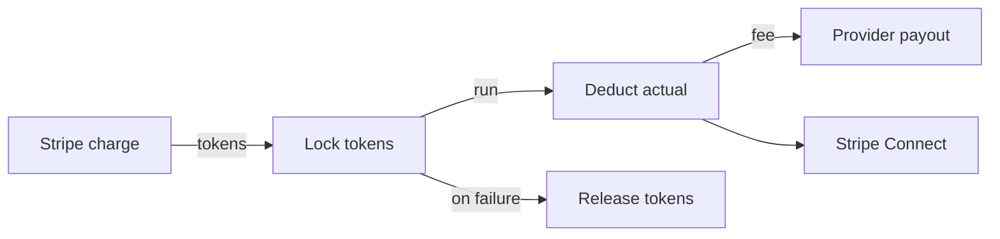
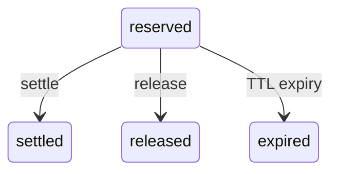

## Token Lifecycle

### 1. Top-Up

Consumers add tokens to their wallet by paying via Stripe. The minimum top-up is $10 USD (100,000 tokens at the default peg).

1. Consumer initiates a top-up in the wallet UI
2. A Stripe `PaymentIntent` is created
3. On successful payment confirmation, a `topup` ledger entry is recorded
4. The account's `cachedBalance` and `lifetimeTopUp` are incremented atomically

### 2. Reserve (Verify)

When a provider service receives a request, the SDK locks tokens from the consumer's wallet before executing business logic.

1. SDK calls `POST /sdk/tokens/verify` with the consumer's account reference, product, and maximum token amount
2. Backend atomically checks `availableBalance >= maxAmount` using a `$expr` guard
3. `Account.lockedAmount` is incremented by `maxAmount`
4. A `TokenLock` record is created with status `reserved` and a TTL
5. A `reserve` ledger entry is recorded
6. The lock ID is returned to the SDK

### 3. Capture (Settle)

After the business logic completes, the SDK settles the lock with the actual amount consumed (which may be less than the reserved maximum).

1. SDK calls `POST /sdk/tokens/settle` with the lock ID and actual amount
2. Backend validates the lock is still `reserved` and `amount <= lock.amount`
3. `Account.lockedAmount` is decremented by the full reserved amount
4. `Account.lifetimeSpent` is incremented by the settled amount
5. A `capture` ledger entry is recorded for the settled amount
6. If `settledAmount < reservedAmount`, a `release` entry is recorded for the difference
7. The provider's payable balance increases (minus platform fee)
8. The lock is marked as `settled`

### 4. Release

If the business logic fails or the handler completes without settling, the lock is released and all reserved tokens return to the consumer's available balance.

1. SDK calls `POST /sdk/tokens/release` (or the lock expires via TTL)
2. `Account.lockedAmount` is decremented by the full reserved amount
3. A `release` ledger entry is recorded
4. The lock is marked as `released`

## Immutable Ledger

Every token movement is recorded as an immutable `AccountTransaction` entry with a monotonically increasing sequence number per account. The ledger is the **source of truth** — the `cachedBalance` on the account document is a denormalized optimization for fast reads.

### Transaction Types

| Type | Direction | Description |
|------|-----------|-------------|
| `topup` | Credit | Tokens added via Stripe payment |
| `reserve` | Info | Tokens locked for a pending request |
| `capture` | Debit | Tokens charged for a completed request |
| `release` | Info | Reserved tokens returned to available balance |
| `adjustment` | Either | Admin correction |
| `reversal` | Debit | Chargeback clawback |

### Concurrency Safety

The ledger uses optimistic concurrency with a unique `(accountId, sequence)` index. If two writes race for the same sequence number, one will fail and be retried with an incremented sequence. This guarantees:

- No double-spends
- No lost updates
- Deterministic ordering within an account

### Idempotency

Critical operations (reserve, capture, release) include an `idempotencyKey` in the ledger entry. A unique sparse index on `idempotencyKey` prevents duplicate writes. Retrying the same operation with the same key is safe — the duplicate is silently rejected.

## Token Locks

A `TokenLock` record represents an in-flight reservation. It tracks:

| Field | Description |
|-------|-------------|
| `reference` | Unique lock ID (e.g., `tlk_a1b2c3d4`) |
| `accountId` | Consumer account |
| `amount` | Reserved token amount |
| `settledAmount` | Actual tokens charged (set on settle) |
| `providerId` | Which provider the lock is for |
| `productReference` | Which product |
| `status` | `reserved` → `settled` or `released` or `expired` |
| `expiresAt` | TTL deadline for auto-release |
| `voucherId` | If this lock is backed by a voucher (optional) |

### Lock States

A background job runs every 60 seconds to release expired locks, ensuring tokens are never permanently locked if a provider fails to settle.

## Balance Caching

To avoid querying the ledger on every `verifyPayment` call (the hot path), the current balance is cached directly on the `Account` document as `cachedBalance`. This field is updated atomically alongside every ledger write.

The atomic lock guard uses a MongoDB `$expr` to compare `cachedBalance - lockedAmount >= requestedAmount` in a single `findOneAndUpdate`, making the entire verify operation lock-free and race-safe.

## Provider Settlement

When tokens are captured, they do not go directly to the provider. Instead:

1. A **platform fee** (default 10%) is deducted from the captured amount
2. The net amount is recorded as a `payable_increase` entry in the `ProviderEarnings` ledger
3. A periodic settlement job aggregates unpaid balances and issues fiat payouts via **Stripe Connect**

This batching eliminates per-transaction fees on the provider side and keeps the system economically viable for microtransactions.

| Settlement Property | Default |
|-------------------|---------|
| Platform fee | 10% |
| Payout frequency | Daily |
| Minimum payout balance | 100,000 tokens ($10) |
| Payout method | Stripe Connect transfer |

## Next Steps

- [SDK Integration](/wallet/sdk-integration) — Implement the verify/settle/release flow in your code
- [Provider Integration](/wallet/provider-integration) — Accept payments and track earnings
- [Vouchers](/wallet/vouchers) — Prepaid voucher tokens with reserved balances
