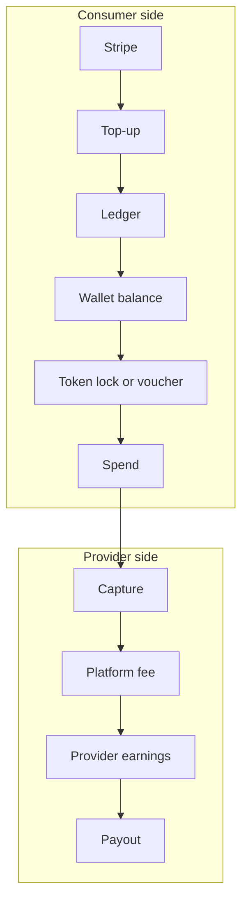

## Why Tokens?

Traditional payment processing has a floor: Stripe charges ~$0.30 + 2.9% per transaction. For a $0.05 API call, that's a 700% fee. The token system solves this by:

1. **Batching payments** — Consumers top up once ($10+), receiving tokens they spend over many requests
2. **Integer precision** — All amounts are stored as integer microunits, eliminating floating-point errors
3. **Aggregated settlement** — Provider earnings are batched and settled periodically in fiat

## Token Model

Tokens are internal, non-transferable prepaid units pegged to USD:

| Property | Value |
|----------|-------|
| **Peg** | 1 token = $0.0001 USD (configurable) |
| **Storage** | Integer microunits (no floating point) |
| **Minimum top-up** | $10 USD (configurable) = 100,000 tokens |
| **Transferable** | No — tokens stay in the consumer's wallet |
| **Withdrawable** | No — tokens can only be spent on services |

Example conversions:

| USD Amount | Tokens |
|-----------|--------|
| $0.01 | 100 |
| $0.50 | 5,000 |
| $1.00 | 10,000 |
| $10.00 | 100,000 |

## Key Concepts

### Consumer Wallet

Every consumer account has a wallet with:

- **Balance** — Total tokens available (derived from ledger)
- **Locked amount** — Tokens reserved by active locks or vouchers
- **Available balance** — `balance - lockedAmount` (what can be spent right now)

### Payment Schemes

SolvaPay supports three payment schemes through the SDK:

| Scheme | Description | Use Case |
|--------|-------------|----------|
| **`limits`** | Plan-based access with usage quotas | SaaS plans with monthly limits |
| **`upto`** | Two-phase token lock from wallet balance | Per-request metered billing |
| **`voucher`** | Prepaid voucher with reserved token balance | Prepaid access tokens for third parties |

### Provider Settlement

Providers never receive tokens directly. When tokens are captured from a consumer, the provider's **payable balance** increases (minus a configurable platform fee). Payouts are settled periodically via Stripe Connect in fiat currency.

## Architecture

## Next Steps

- [How It Works](/wallet/how-it-works) — Detailed token lifecycle and ledger mechanics
- [SDK Integration](/wallet/sdk-integration) — Implement token payments in your service
- [Provider Integration](/wallet/provider-integration) — Accept token payments and receive settlements
- [Vouchers](/wallet/vouchers) — Issue prepaid vouchers to third parties
- [Security & Compliance](/wallet/security) — Audit trail, chargebacks, and risk controls
