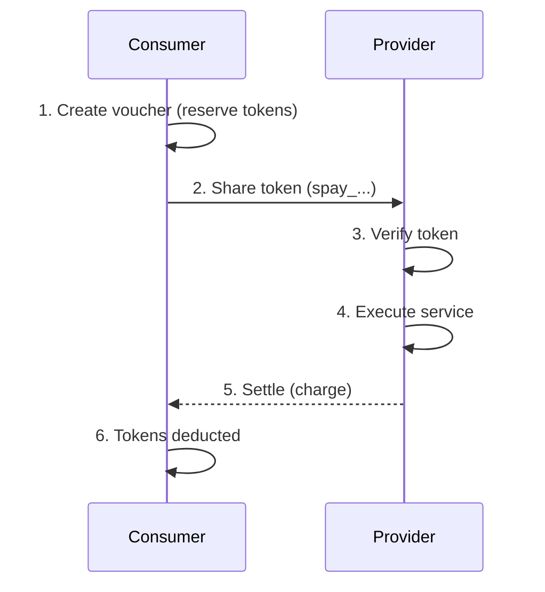
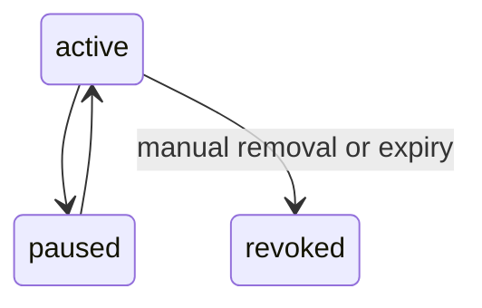

## How Vouchers Work



### Consumer Side

1. Consumer creates a voucher in their wallet, specifying an amount to reserve
2. The system checks the wallet has sufficient available balance
3. The reserved amount is locked in the wallet (`lockedAmount` increases)
4. An encrypted token (`spay_...`) is issued

### Provider Side

5. Provider receives the `spay_...` token from the consumer
6. Provider SDK verifies the token and locks tokens within the voucher for the request
7. Provider executes the business logic
8. Provider settles with the actual amount consumed
9. Unused reservation returns to the voucher balance for future use

## Creating Vouchers

Consumers create vouchers through the wallet UI. Each voucher has:

| Field | Description |
|-------|-------------|
| **Name** | A label for the voucher (e.g., "API access for Agent X") |
| **Amount** | Tokens to reserve from the wallet |
| **Expiry** | Optional expiration (0–120 days) |
| **Spend Limit** | Optional per-period and per-request caps |

### Amount Reservation

When a voucher is created:

- The wallet's `lockedAmount` increases by the voucher amount
- These tokens are guaranteed available until the voucher expires or is removed
- The locked tokens cannot be used by other vouchers or `upto` locks

### Expiry

If an expiry is set, a background job automatically revokes the voucher when it expires and releases the remaining reserved tokens back to the wallet.

### Spend Limits

Vouchers support optional rate limiting on top of the hard amount:

| Limit | Description |
|-------|-------------|
| **Period limit** | Max tokens per hour/day/month |
| **Per-request limit** | Max tokens per single request |

These are checked during `verifyVoucherPayment` in addition to the remaining balance.

## Multi-Use Vouchers

Vouchers are **multi-use** — they can be used for multiple requests until the reserved balance runs out. Each request creates a separate `TokenLock` scoped to the voucher.

Example: A voucher with 10,000 tokens reserved can serve:
- 100 requests at 100 tokens each
- 20 requests at 500 tokens each
- Any mix until the balance is exhausted

## Voucher Token Format

The token string (`spay_...`) is an encrypted payload containing:

- Account reference
- Voucher ID
- Issuance timestamp

The token is encrypted with AES and can only be decrypted by the SolvaPay backend. It cannot be forged or tampered with.

### Token Revocation

Reissuing a voucher token invalidates all previously issued tokens for that voucher. The backend checks the issuance timestamp against the stored `tokenIssuedAt` to reject stale tokens.

## Payment Flow (Two-Phase)

The voucher payment flow mirrors the `upto` scheme but locks tokens **within the voucher's reserved balance** rather than from the wallet directly.

### Verify

```
POST /sdk/vouchers/verify
{
  "token": "spay_abc123...",
  "maxAmount": 500,
  "productRef": "prd_myapi",
  "providerId": "prv_xxx"
}
```

1. Decrypts and validates the voucher token
2. Checks voucher is active and not expired
3. Checks `remaining >= maxAmount`
4. Atomically increments `voucher.spent` by `maxAmount`
5. Creates a `TokenLock` with `voucherId` set
6. Returns lock ID, account identity, and remaining balance

### Settle

```
POST /sdk/vouchers/settle
{
  "lockId": "...",
  "amount": 350,
  "description": "Analysis completed"
}
```

1. Validates the lock is `reserved` and voucher-backed
2. If `amount < reservedAmount`, refunds the difference to `voucher.spent`
3. Decrements `Account.lockedAmount` by the settled amount (tokens leave the wallet permanently)
4. Records `capture` and `release` ledger entries
5. Credits the provider (minus platform fee)
6. Marks the lock as `settled`

### Release

```
POST /sdk/vouchers/release
{
  "lockId": "...",
  "reason": "cancelled"
}
```

1. Decrements `voucher.spent` by the full reserved amount
2. Marks the lock as `released`
3. Tokens remain locked by the voucher but available for future requests

## Idempotency

- Each `verifyVoucherPayment` creates a unique `TokenLock` with a reference ID — this is the idempotency boundary
- `settleVoucherPayment` checks `lock.status === 'reserved'` — a second settle on the same lock fails cleanly with a `409 Conflict`
- Ledger entries use idempotency keys derived from `lockId + action` to prevent duplicates

## Voucher States



| State | Description |
|-------|-------------|
| `active` | Voucher is usable, tokens are reserved |
| `paused` | Voucher is temporarily disabled, reserved tokens are released |
| `revoked` | Voucher is permanently disabled, remaining tokens are released |

When a voucher is paused, the remaining balance is released from `lockedAmount`. When resumed, the balance is re-locked (if sufficient funds are available).

## Removing a Voucher

When a voucher is removed:

1. Any remaining balance (`amount - spent`) is released from `lockedAmount`
2. The voucher is removed from the account
3. Previously issued tokens become invalid

## SDK Usage

### With `payable()` Wrapper

The simplest way — the SDK handles everything:

```typescript
const payable = solvaPay.payable({
  scheme: 'voucher',
  product: 'prd_myapi',
  providerId: 'prv_xxx',
  maxPrice: 500,
})

server.tool('analyze', payable.mcp(async (args) => {
  // args._voucherId — the voucher ID
  // args._accountRef — consumer account
  // args._identity — { fingerprint, publicKey }
  // args._remaining — voucher balance after reservation

  const result = await runAnalysis(args)
  await args.settle(result.tokenCost)
  return result
}))
```

### Direct API Client

For full control:

```typescript
// Verify
const lock = await solvaPay.apiClient.verifyVoucherPayment({
  token: 'spay_abc123...',
  maxAmount: 500,
  productRef: 'prd_myapi',
  providerId: 'prv_xxx',
})

// Execute business logic...

// Settle
const result = await solvaPay.apiClient.settleVoucherPayment({
  lockId: lock.lockId,
  amount: 350,
})

// Or release
await solvaPay.apiClient.releaseVoucherPayment({
  lockId: lock.lockId,
  reason: 'operation cancelled',
})
```

### Read-Only Inspection

Check a voucher without locking tokens:

```typescript
const info = await solvaPay.apiClient.resolveVoucher({
  token: 'spay_abc123...',
})

console.log(info.balance)     // remaining tokens
console.log(info.status)      // 'active'
console.log(info.spendLimit)  // rate limits, if set
```

## Next Steps

- [SDK Integration](/wallet/sdk-integration) — Full reference for all payment schemes
- [Provider Integration](/wallet/provider-integration) — Accept voucher payments and track earnings
- [Security & Compliance](/wallet/security) — Audit trails and fraud protection
